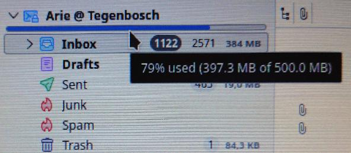

# IMAP Quota Status

A Thunderbird extension that displays IMAP mailbox quota usage as a color-coded pill in the window and as progress bars beneath each IMAP account in the folder pane.


---

## Features

- **Status pill** — floating indicator centred at the bottom of the Thunderbird window, showing the account with the highest quota usage
- **Folder pane bars** — thin color-coded progress bars injected beneath each IMAP account row
- **Four-color scale** — 🟢 green / 🔵 blue / 🟡 yellow / 🔴 red with configurable thresholds
- **Tooltip** — hover the pill to see all accounts with their usage
- **Click to refresh** — click the pill for an immediate quota update
- **Configurable** — poll interval, bar height, color thresholds, and visibility toggles via a settings page

## Screenshots




---

## Requirements

- Thunderbird 128 or later
- IMAP accounts whose server supports the `QUOTA` capability (RFC 2087)

> **Permission prompt:** Because this extension uses a Thunderbird Experiment API, Thunderbird will ask you to grant it **"full, unrestricted access to Thunderbird and your computer"** during installation. This is required for any extension that uses Experiment APIs and cannot be avoided. No `about:config` changes are needed — Thunderbird does not enforce extension signing by default.

> **Experiment API setting:** This extension requires `extensions.experiments.enabled` to be set to `true` in Thunderbird. This is the default, but if the extension fails to load, verify via **Edit → Preferences → General → Config Editor** (or `about:config`) and search for `extensions.experiments.enabled`.

> **Note:** Servers that do not advertise the `QUOTA` capability (e.g. Outlook, Hotmail, AOL) will show no quota data for those accounts.

---

## Installation

### From the .xpi file

1. Download the latest `thunderbird-imap-quota.xpi` from the [Releases](https://github.com/elnarte/thunderbird-imap-quota/releases) page
2. In Thunderbird, open **Tools → Add-ons and Themes**
3. Click the gear icon ⚙️ and choose **Install Add-on From File…**
4. Select the downloaded `.xpi` file

### From source

```bash
git clone https://github.com/elnarte/thunderbird-imap-quota.git
cd thunderbird-imap-quota
zip -r thunderbird-imap-quota.xpi . -x "*.git*" "*.DS_Store" "README.md" "LICENSE" "docs/*" "images/*"
```

Then install the generated `.xpi` as described above.

---

## Settings

Open **Add-ons and Themes → IMAP Quota Status → Preferences** to configure:

| Setting | Default | Description |
|---|---|---|
| Show status pill | on | Show/hide the floating pill |
| Show folder pane bars | on | Show/hide the progress bars |
| Poll interval | 5 min | How often quota is refreshed automatically |
| Bar height | 4 px | Height of the folder pane progress bars |
| Red threshold | 90% | Usage percentage at which the indicator turns red |
| Yellow threshold | 80% | Usage percentage at which the indicator turns yellow |
| Blue threshold | 70% | Usage percentage at which the indicator turns blue |

---

## File Structure

```
thunderbird-imap-quota/
├── manifest.json          # Extension manifest (Manifest V3)
├── background.js          # Background script — orchestration and polling
├── imapQuota-api.js       # Thunderbird Experiment API — privileged XPCOM access
├── imapQuota-schema.json  # Schema declaring the experiment's public API surface
├── options.html           # Settings page UI
├── options.js             # Settings page logic
├── icons/
│   └── icon.svg           # Extension icon (SVG, scales to any resolution)
├── images/
│   ├── IMAP-Quota-Bar.jpg # Screenshot — folder pane quota bars
│   └── IMAP-Quota-Pill.jpg# Screenshot — status pill
├── docs/
│   └── technical.md       # Technical implementation documentation
└── README.md
```

---

## Technical Overview

The extension uses a **Thunderbird Experiment API** to access IMAP internals and inject UI elements that are unavailable to standard WebExtensions. The background script orchestrates periodic polling via `messenger.alarms`, reads quota data through the experiment's `nsIMsgImapMailFolder.getQuota()` bridge, and updates both the pill and the folder pane bars.

See [`docs/technical.md`](docs/technical.md) for a full description of the architecture, quota fetching flow, pill-click refresh mechanism, and UI injection approach.

---

## Compatibility

| Server | QUOTA support |
|---|---|
| cPanel / Dovecot | ✅ Yes |
| Cyrus IMAP | ✅ Yes |
| Gmail | ✅ Yes |
| Outlook / Hotmail | ❌ No |
| AOL / Netscape | ❌ No |
| Zoho Mail | ❌ No |
| Skynet (Proximus) | ✅ Yes |

---

## Development

The extension requires no build step. Edit the source files directly and reload via **about:debugging → This Thunderbird → Reload**.

To inspect logs, open the extension console: **about:debugging → This Thunderbird → IMAP Quota Status → Inspect**.

All refresh events and quota values are logged with the `[imap-quota]` prefix.

---

## License

MIT — see [LICENSE](LICENSE) for details.

---

## Author

[**Arie Tegenbosch**](mailto:arie@tegenbosch.be) a.k.a. [**El Narte Mail**](mailto:elnartemail@netscape.net)

Extension implemented with [Claude Sonnet 4.6](https://claude.ai) (Anthropic).
